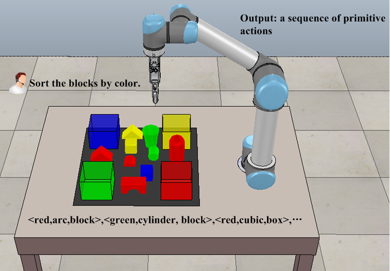

# Transformer based Task Planning for Vision-and-Language Manipulation

This repository will provide PyTorch code for training and testing a transformer based task planner for Vision-and-Language Manipulation (VLM) in simulation settings on a UR5/UR3 robot arm. This is the reference implementation for the manuscript submitted to <i>IROS 2022</i>.

### Transformer based Task Planning for Vision-and-Language Manipulation

Vision-and-Language Manipulation (VLM) is a task where agents learn to plan and operate in workspace following natural language instructions. We propose to learn how to convert a language-defined task into a planned action sequence, rather than manually decompose the task using step-by-step instructions that can be directly resolved to specific actions. Specifically, we formulate the task planning in VLM as a sequence-to-sequence problem. A transformer based model is built, taking natural language word sequence and visual object sequence as inputs and then outputting action symbol sequence. Through our experiments on simulated environments, we demonstrate the ability of our model to plan action sequence effectively,and show how high the task planning accuracies on training and testing datasets.

<!--  -->

Fig.1. A VLM task where the robot must plan a sequence of primitive actions according to the instruction "Sort the blocks by color" as well as the object symbols recognized by the vision system.

#### Contact
If you have any questions or find any bugs, please let me know: [Jiatong Bao] jtbao[at]yzu[dot]edu[dot]cn

## Installation
To be continued.

#### Pretrained Models
To be continued.

#### Training Dataset
To be continued.

#### Testing Dataset
To be continued.

## Acknowledgement
Our code is based on the implementation of a [Transformer](https://github.com/SamLynnEvans/Transformer) model for language translation.